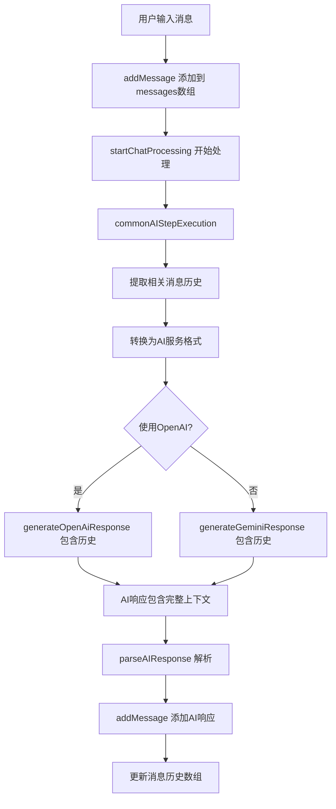

# 双AI聊天应用上下文修复架构方案

## 问题总结

### 核心问题识别
基于Debug分析报告，确认了AI无法读取对话开头上下文的根本原因：

1. **主要问题**：[`commonAIStepExecution`](dual-ai-chat/hooks/useChatLogic.ts:97-147) 函数只传递单个 `prompt`，完全缺少消息历史传递机制
2. **次要问题**：[`discussionLog`](dual-ai-chat/hooks/useChatLogic.ts:435) 仅存储当前讨论轮次，不包含用户历史对话

### 数据流断层分析
```
用户消息历史 (messages[]) → X 断层 X → AI服务调用 (只有prompt)
```

---

## 解决方案架构设计

### 1. 消息历史传递机制重构

#### 1.1 核心架构变更

```typescript
// 新增：消息历史参数
interface AICallContext {
  prompt: string;
  messageHistory: ChatMessage[];          // 新增：完整消息历史
  currentDiscussionLog?: string[];        // 可选：当前讨论日志
  systemInstruction?: string;
  imagePart?: ImagePart;
}
```

#### 1.2 数据流重构

**修复前（断层）：**
```
App.tsx (messages) → useChatLogic → commonAIStepExecution → AI Service (prompt only)
```

**修复后（连续）：**
```
App.tsx (messages) → useChatLogic → commonAIStepExecution → AI Service (prompt + history)
```

### 2. AI服务层接口重构

#### 2.1 OpenAI服务修改
```typescript
// 修改 generateOpenAiResponse 函数签名
export const generateOpenAiResponse = async (
  prompt: string,
  modelId: string,
  apiKey: string,
  baseUrl: string,
  systemInstruction?: string,
  imagePart?: { mimeType: string; data: string },
  temperature?: number,
  messageHistory?: ChatMessage[]  // 新增参数
): Promise<OpenAiResponsePayload>
```

#### 2.2 Gemini服务修改
```typescript
// 修改 generateResponse 函数签名
export const generateResponse = async (
  prompt: string,
  modelName: string,
  useCustomConfig: boolean,
  customApiKey?: string,
  customApiEndpoint?: string,
  systemInstruction?: string,
  imagePart?: { inlineData: { mimeType: string; data: string } },
  thinkingConfig?: { thinkingBudget: number },
  temperature?: number,
  messageHistory?: ChatMessage[]  // 新增参数
): Promise<GeminiResponsePayload>
```

### 3. 消息转换策略

#### 3.1 ChatMessage 到 OpenAI 格式转换器

```typescript
function convertChatMessageToOpenAI(message: ChatMessage): OpenAiChatMessage {
  const role = mapSenderToOpenAIRole(message.sender);
  return {
    role,
    content: message.text,
    // 处理图片等其他内容
  };
}

function mapSenderToOpenAIRole(sender: MessageSender): 'user' | 'assistant' | 'system' {
  switch (sender) {
    case MessageSender.User: return 'user';
    case MessageSender.Cognito:
    case MessageSender.Muse: return 'assistant';
    case MessageSender.System: return 'system';
    default: return 'user';
  }
}
```

#### 3.2 ChatMessage 到 Gemini 格式转换器

```typescript
function convertChatMessageToGemini(message: ChatMessage): GeminiMessage {
  // 根据 Gemini API 规范转换
  const role = mapSenderToGeminiRole(message.sender);
  return {
    role,
    parts: [{ text: message.text }]
  };
}
```

### 4. commonAIStepExecution 重构方案

#### 4.1 函数签名扩展
```typescript
const commonAIStepExecution = useCallback(async (
  stepIdentifier: string,
  prompt: string,
  modelDetailsForStep: AiModel,
  senderForStep: MessageSender,
  purposeForStep: MessagePurpose,
  messageHistory: ChatMessage[],          // 新增：消息历史
  imageApiPartForStep?: ImagePart,
  userInputForFlowContext?: string,
  imageApiPartForFlowContext?: ImagePart,
  discussionLogBeforeFailureContext?: string[],
  currentTurnIndexForResumeContext?: number,
  previousAISignaledStopForResumeContext?: boolean
): Promise<ParsedAIResponse>
```

#### 4.2 历史消息集成逻辑
```typescript
// 在 commonAIStepExecution 内部
const relevantHistory = filterRelevantMessages(messageHistory, senderForStep);
const contextualPrompt = buildContextualPrompt(prompt, relevantHistory, discussionLogBeforeFailureContext);

// 调用 AI 服务时传递历史
if (useOpenAiApiConfig) {
  result = await generateOpenAiResponse(
    contextualPrompt,
    currentOpenAiModelId,
    openAiApiKey,
    openAiApiBaseUrl,
    systemInstructionToUse,
    imageApiPartForStep,
    temperature,
    relevantHistory  // 传递历史消息
  );
}
```

### 5. 讨论日志机制改进

#### 5.1 上下文整合策略
```typescript
interface EnhancedDiscussionContext {
  userConversationHistory: ChatMessage[];     // 用户对话历史
  currentDiscussionLog: string[];            // 当前AI讨论
  systemMessages: ChatMessage[];             // 系统消息
}

function buildFullContext(
  messageHistory: ChatMessage[],
  discussionLog: string[]
): EnhancedDiscussionContext {
  return {
    userConversationHistory: messageHistory.filter(isUserConversationMessage),
    currentDiscussionLog: discussionLog,
    systemMessages: messageHistory.filter(isSystemMessage)
  };
}
```

---

## 实施Roadmap

### 阶段1：服务层重构（优先级：高）
- 修改 [`openaiService.ts:35`](dual-ai-chat/services/openaiService.ts:35) 的 [`generateOpenAiResponse`](dual-ai-chat/services/openaiService.ts:35)
- 修改 [`geminiService.ts:52`](dual-ai-chat/services/geminiService.ts:52) 的 [`generateResponse`](dual-ai-chat/services/geminiService.ts:52)  
- 实现消息格式转换器
- 向后兼容性处理（messageHistory 参数可选）

### 阶段2：核心逻辑重构（优先级：高）
- 重构 [`useChatLogic.ts:97`](dual-ai-chat/hooks/useChatLogic.ts:97) 的 [`commonAIStepExecution`](dual-ai-chat/hooks/useChatLogic.ts:97) 
- 传递完整消息历史到AI服务调用
- 更新所有调用 [`commonAIStepExecution`](dual-ai-chat/hooks/useChatLogic.ts:97) 的地方

### 阶段3：上下文整合优化（优先级：中）
- 改进 [`discussionLog`](dual-ai-chat/hooks/useChatLogic.ts:435) 机制
- 实现智能上下文过滤
- 添加上下文长度管理

### 阶段4：性能与测试（优先级：中）
- 性能监控和优化
- 错误处理完善
- 端到端测试验证

---

## 技术实施细节

### 消息历史传递流程图



### 关键修改点定位

1. **[`useChatLogic.ts:126-134`](dual-ai-chat/hooks/useChatLogic.ts:126-134)**：OpenAI调用点
2. **[`useChatLogic.ts:136-147`](dual-ai-chat/hooks/useChatLogic.ts:136-147)**：Gemini调用点
3. **[`openaiService.ts:35-43`](dual-ai-chat/services/openaiService.ts:35-43)**：函数签名
4. **[`geminiService.ts:52-62`](dual-ai-chat/services/geminiService.ts:52-62)**：函数签名
5. **所有调用 [`commonAIStepExecution`](dual-ai-chat/hooks/useChatLogic.ts:97) 的位置**：需要传递消息历史

---

## 风险控制措施

### 1. 向后兼容性保障
- 消息历史参数设为可选，默认为空数组
- 渐进式部署，逐步启用历史传递
- 保留原有调用方式作为fallback

### 2. 性能管理
- 初始实现传递完整历史，后续可添加智能截断
- 监控API调用token消耗
- 设置最大上下文长度限制

### 3. 错误处理
- 历史消息转换失败时使用原始prompt
- API调用失败时保持原有重试机制
- 详细错误日志记录

### 4. 测试策略
- 单元测试：消息转换器
- 集成测试：端到端对话流程
- 用户验收测试：实际对话场景验证

---

## 预期效果

### 修复后的对话体验
1. **上下文连续性**：AI能够引用对话开头的内容
2. **对话一致性**：AI回复与整个对话历史保持一致  
3. **用户体验提升**：无需重复提供背景信息

### 技术指标
- **上下文覆盖率**：100%（传递完整历史）
- **兼容性**：保持现有功能完整性
- **性能影响**：可控（通过后续优化管理）

---

## 总结

本方案通过系统性重构消息传递机制，从根本上解决AI无法读取对话开头上下文的问题。采用分阶段实施策略，确保修复效果的同时保持系统稳定性。

**关键成功因素：**
- 准确识别并修复数据流断层  
- 保持向后兼容性
- 分阶段实施降低风险
- 充分的测试验证